# Photo Gallery System (CMS)

### Photo Gallery System is based on CMS which offers a lot of features to the users as well as having proper Admin Section to manage the images, users and sees over all the data

### Key Features in this project : 
        1) OOPS
        2) Login System with Sessions Handling 
        3) Pagination
        4) Upload Files
        5) Admin Section with interactive Dashboard 
        6) User Management
 

#### Index page - Shows all the images in the gallary
 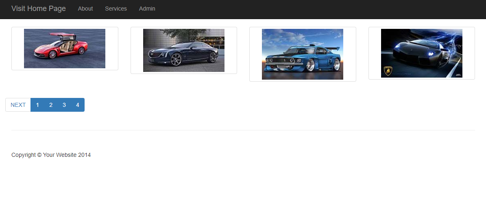

#### Admin page - Login 
 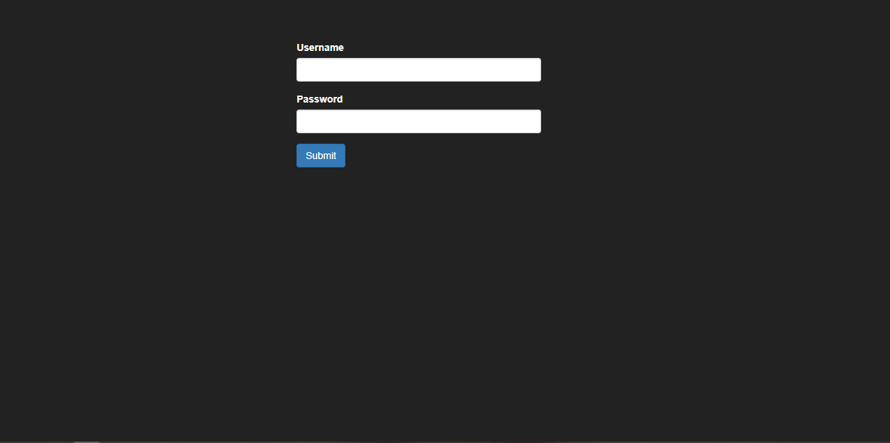

#### Admin page - After Login Dashboard : 
 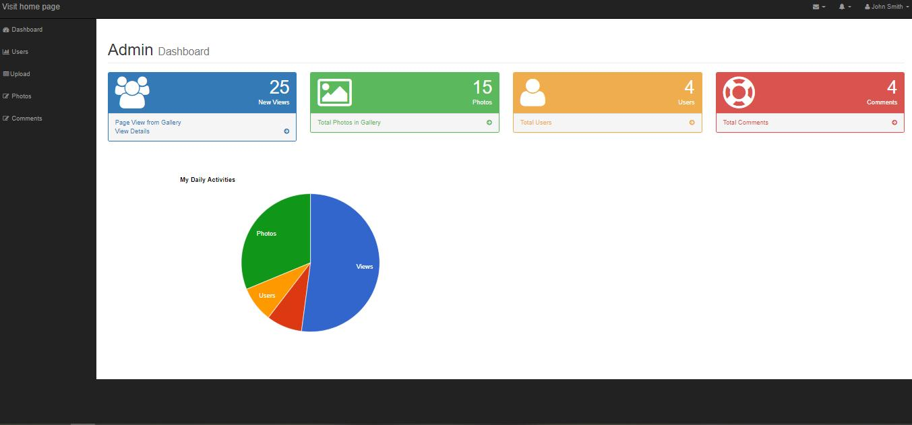

#### Admin page - users 
 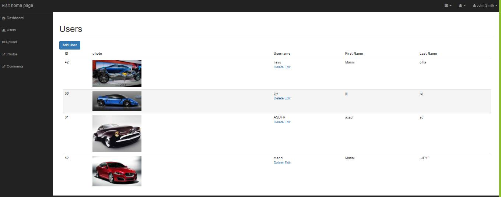

#### Admin page - users => create new 
 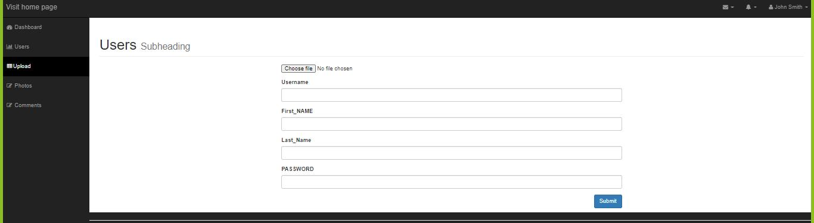

#### Admin page - users => edit 
 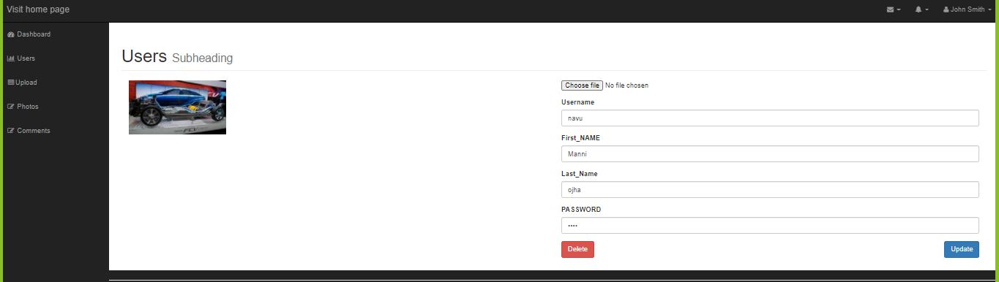

#### Admin page - users => delete
 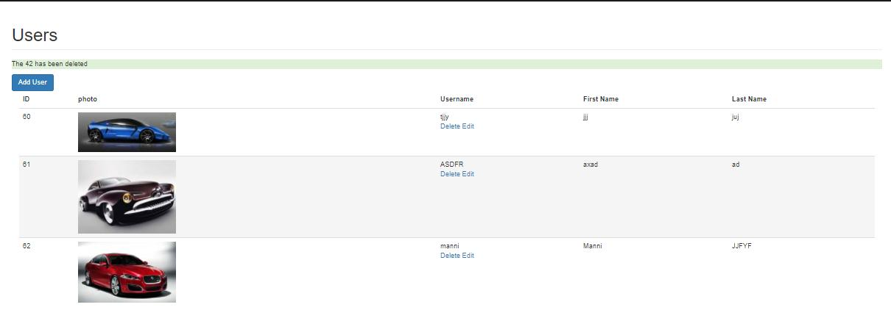

#### Admin page - Upload 
 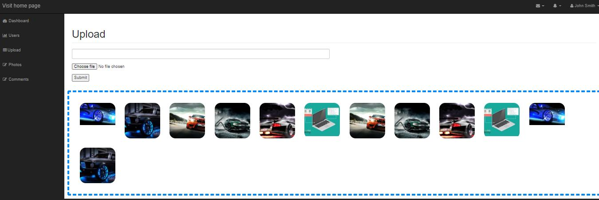

#### Admin page - All Photos 
 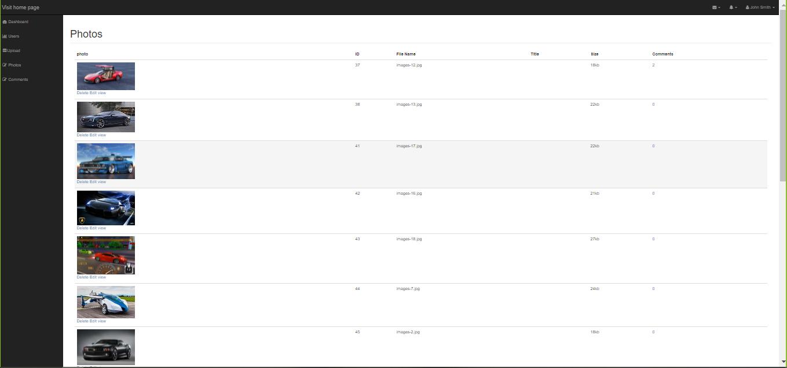

#### Admin page - Edit Photo details
 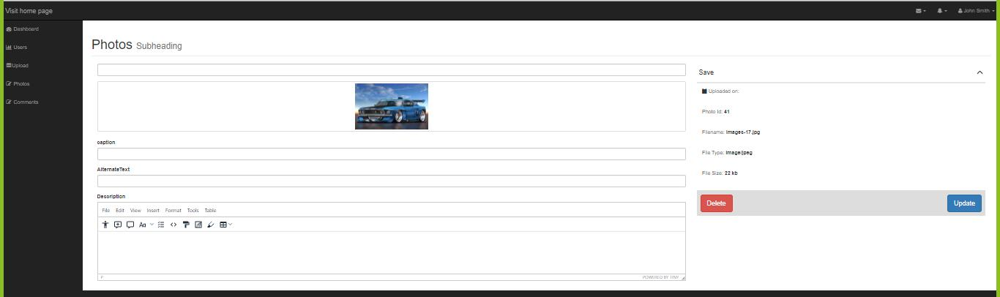

#### Admin page - Add Comment on Photo 
 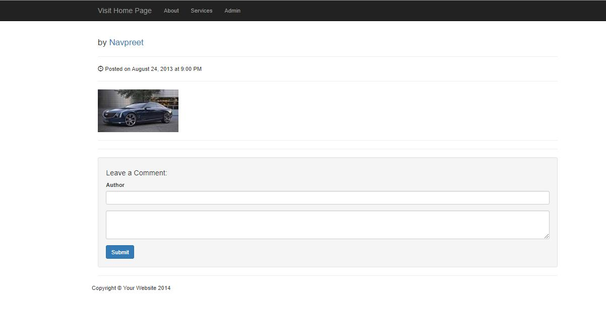

#### Admin page - All comments
 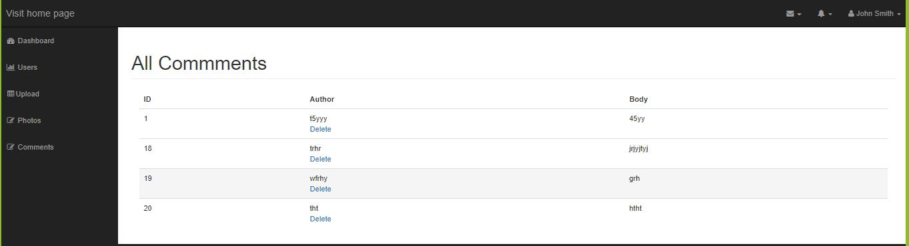
